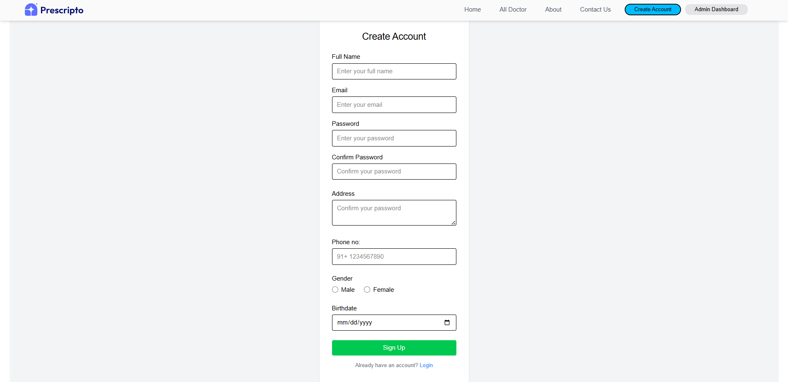
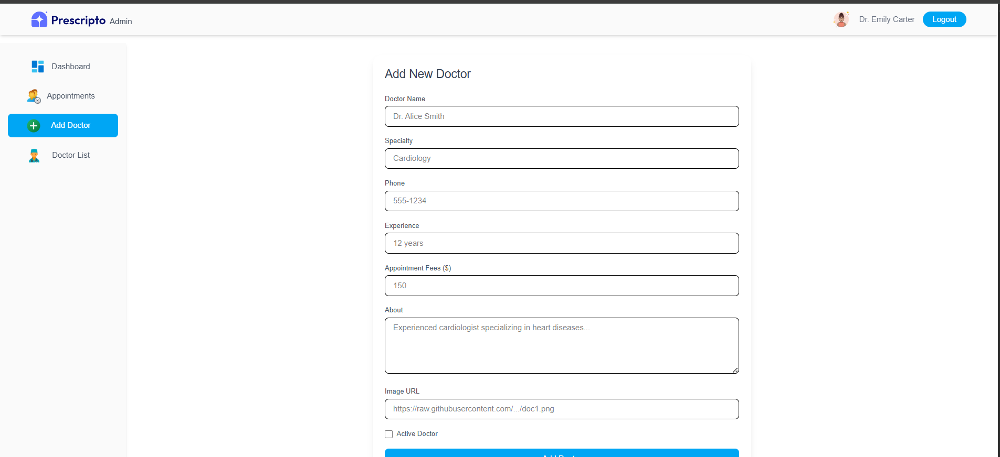
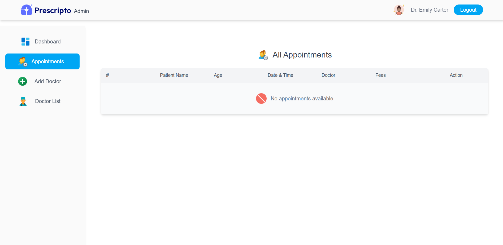
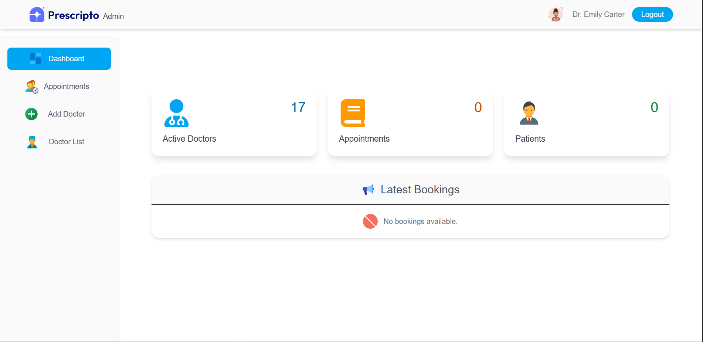
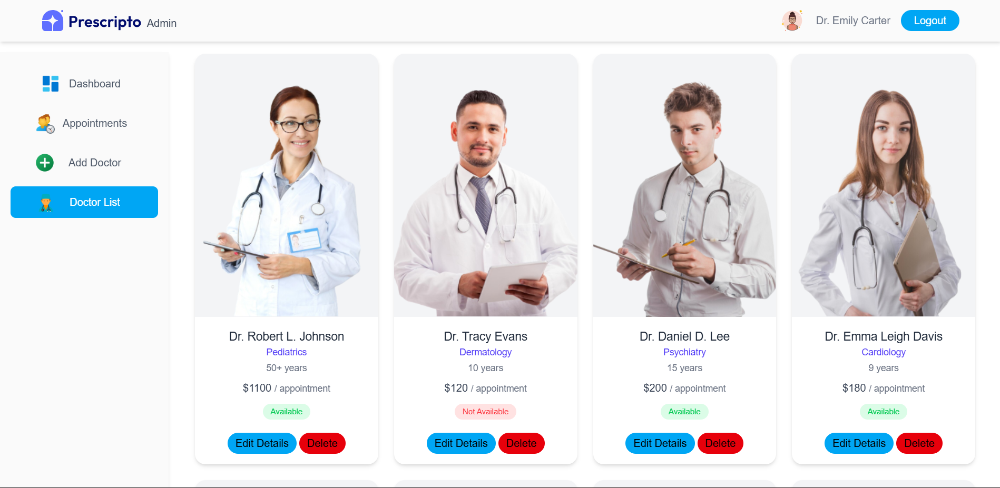
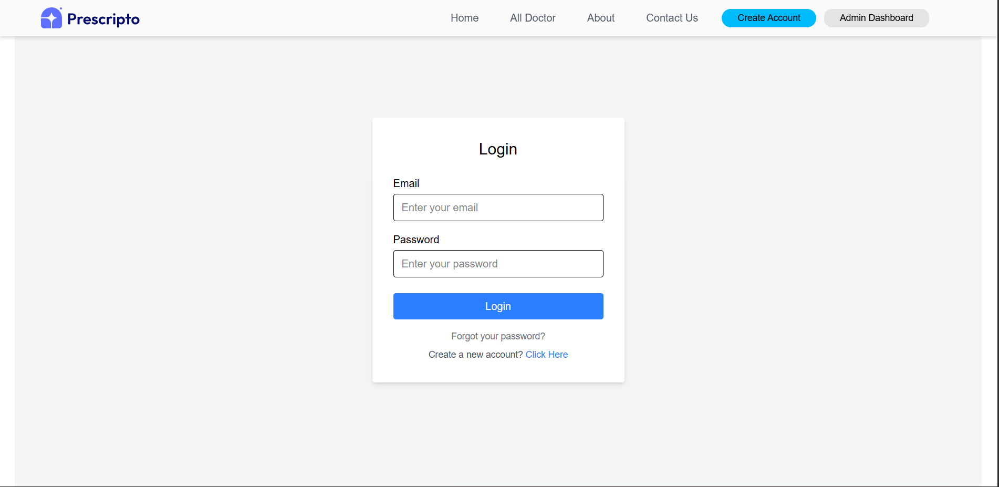
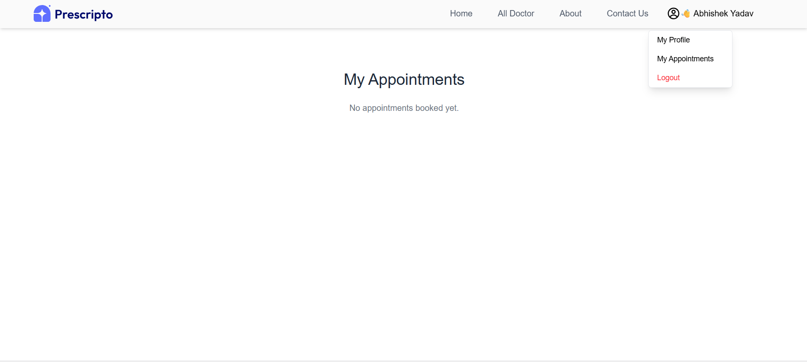
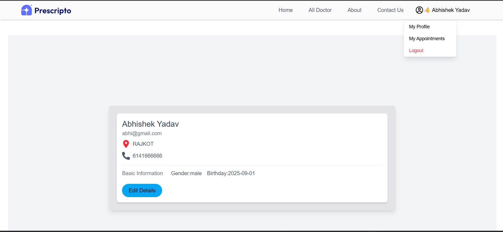

# Hospital Management App

A hospital management application built with **React**. This project provides a simple interface to manage hospital data including patients, appointments, and staff.

## Features

*client side(patients)*
------------------------------
-Signup-SignIn
-fetch data with json-server with api
- View patient information
- Manage or Book  appointments
- Edit Profile Details


*Admin Side*
-----------------------------------
-view all doctor and Patients and Appointment
-edit or add Doctor Details
-Delete Doctor
-admin can delete Appointments
----------------------
- Responsive and interactive UI built with React
- Data storage using JSON or mock database

## Screenshots










## Tech Stack

- **Frontend:** React, JavaScript, HTML, CSS
- **Build Tool:** Vite
- **Data:** JSON / Mock backend/local-storage

## Getting Started

### Prerequisites

- Node.js (v14+)

### Installation

1. Clone the repository:

```bash
git clone https://github.com/YadavAbhishek01/Hospital-Management.git
cd Hospital-Management
```

2. Start json-server:

```bash
json-server --watch db.json
```
